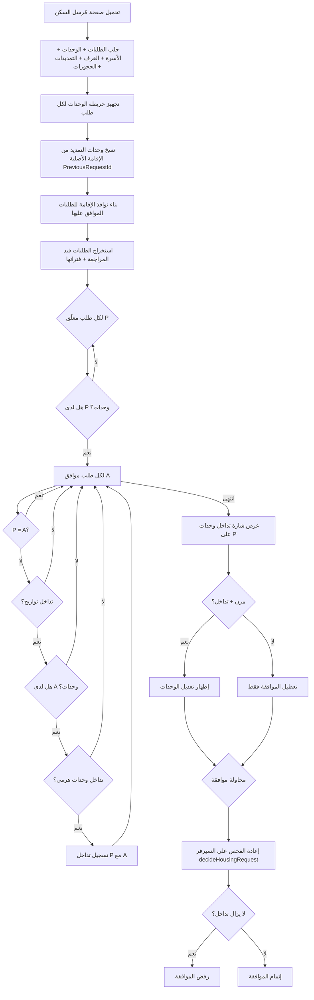

# فحص تداخل الوحدات (Housing Unit Overlap)

يوضح هذا المستند كيف يعمل فحص **تداخل وحدات** في صفحة **مُرسل السكن** (`housing-sender`) وعند **موافقة القائد** على الطلب.

المنطق الرئيسي في:

- `src/lib/housing-request-overlap.ts`
- `src/app/[locale]/housing-sender/page.tsx`
- `src/actions/decideHousingRequest.ts`

---

## نظرة عامة

الفحص يقارن كل طلب **قيد المراجعة** (Pending) مع الطلبات **الموافق عليها** (Approved).

يُعتبر هناك **تداخل** عندما يتحقق **الشرطان معاً**:

1. **تداخل التواريخ** — ليلة واحدة على الأقل مشتركة بين فترتي الإقامة.
2. **تداخل الوحدات** — نفس السرير/الغرفة/الشقة، أو وحدة فرعية داخل وحدة أب (هرمي).

---

## مخطط التدفق



---

## الخطوات بالتفصيل

### المرحلة 1 — تحميل البيانات

عند فتح صفحة مُرسل السكن (`loadSenderData`) يُجلب بالتوازي:

| المصدر | API | الغرض |
|--------|-----|--------|
| الطلبات | `Requests/getAll` | الحالة، التواريخ، التصنيف، `PreviousRequestId` |
| وحدات الطلبات | `RequestUnits/getAll` | شقة / غرفة / سرير لكل طلب |
| الأسرة | `Beds/getAll` (`allStatuses: true`) | خريطة سرير → غرفة (بما فيها المحجوز والمشغول) |
| الغرف | `Rooms/getAll` (`allStatuses: true`) | خريطة غرفة → شقة |
| التمديدات | `Extensions/getAll` | دمج نهاية الإقامة عبر الحجز |
| الحجوزات | `Reservations/getAll` | ربط التمديد بالطلب الأصلي |

> **مهم:** يجب جلب الأسرة والغرف بكل الحالات (`allStatuses: true`) لأن الوحدات المعتمدة تصبح محجوزة/مشغولة ولا تظهر في فلتر «متاح» فقط — بدونها يفشل التداخل الهرمي.

---

### المرحلة 2 — تجهيز الوحدات

```
RequestUnits (خام)
    ↓
buildUnitsByRequestId — تجميع حسب requestId (استبعاد المحذوف)
    ↓
enrichUnitsByRequestIdFromHierarchy — إكمال roomId / apartmentId من جداول الأسرة والغرف
    ↓
aliasExtensionUnitsOnRequestMap — لطلبات التمديد: نسخ وحدات جذر الإقامة (سلسلة PreviousRequestId)
```

**قاعدة التمديد:** طلب التمديد (Extension) لا يخزّن الوحدات عادةً على صفه؛ الوحدات على **الإقامة الأصلية** (`PreviousRequestId`). لذلك تُنسخ الوحدات إلى معرّف طلب التمديد قبل المقارنة.

---

### المرحلة 3 — فترات الإقامة للموافق عليها

الدالة: `buildApprovedStayWindowsForOverlap`

| نوع الطلب | بداية الفترة | نهاية الفترة |
|-----------|--------------|--------------|
| إقامة جديدة (NewStay) | `startDate` للطلب | `endDate` مع دمج أقصى نهاية من التمديدات اللاحقة |
| تمديد (Extension) | `startDate` **للإقامة الأصلية** (جذر السلسلة) | نهاية التمديد المدمجة |
| كيان تمديد (Extensions table) | عبر الحجز → الطلب الأصلي | `endDate` للتمديد |

هذا يطابق منطق حجز الوحدات في `UnitOccupancyService` على الـ Backend.

استخراج الفترة: `extractRequestStayWindow` — يستخدم `endDate` من الـ API أو يحسبها من `startDate + nights`.

---

### المرحلة 4 — قائمة الطلبات المعلّقة

- الحالة: `isRequestStatusPending` — Pending = 1 أو النص `"Pending"` / `"معلق"`.
- يُستخرج `requestId`, `startDate`, `endDate` لكل طلب معلّق.
- إن لم تُستخرج الفترة (لا بداية أو لا نهاية) يُستبعد الطلب من فحص التداخل.

---

### المرحلة 5 — المقارنة (القلب)

الدالة: `findPendingUnitOverlaps`

لكل طلب معلّق **P** ولكل نافذة موافق عليها **A**:

#### 5.1 تخطّي مبكر

- لا وحدات على **P** → تخطّي.
- **P** و **A** نفس المعرّف → تخطّي.

#### 5.2 تداخل التواريخ

الدالة: `requestDateRangesOverlap`

```
P.start < A.end  AND  A.start < P.end
```

(نهاية التاريخ حصرية — نفس منطق الـ Backend.)

#### 5.3 وحدات الطلب الموافق

الدالة: `resolveApprovedUnitsForOverlap`

- إن كان **A** تمديداً → وحدات **جذر الإقامة** دائماً.
- وإلا → وحدات الطلب نفسه.

#### 5.4 تداخل الوحدات

الدالة: `requestUnitsOverlap` + `unitScopesHierarchicallyConflict`

| مستوى أ | مستوى ب | تداخل؟ |
|---------|---------|--------|
| نفس السرير | نفس السرير | نعم |
| غرفة | سرير داخل الغرفة | نعم |
| شقة | غرفة أو سرير داخل الشقة | نعم |

#### 5.5 النتيجة

إن وُجد طلب موافق واحد على الأقل يحقق التاريخ + الوحدات → يُضاف **P** إلى `overlapConflicts`.

---

### المرحلة 6 — العرض في الواجهة

| العنصر | الشرط |
|--------|--------|
| شارة **تداخل وحدات** | `hasApprovedUnitOverlap` — أي طلب معلّق فيه تداخل (ثابت أو مرن) |
| تعطيل زر **موافقة** | نفس الشرط |
| زر **تعديل الوحدات** | معلّق + **مرن** + تداخل (`canLeaderEditHousingRequestUnits`) |
| تبويب **الطلبات الجديدة** | معلّق + تصنيف `NewStay` |
| تبويب **طلبات التمديد** | معلّق + تصنيف `Extension` |
| تبويب **الطلبات المعتمدة** | موافق عليه |

---

### المرحلة 7 — عند الموافقة (السيرفر)

الملف: `src/actions/decideHousingRequest.ts`

قبل حفظ قرار الموافقة:

1. إعادة بناء نفس خرائط الوحدات والنوافذ.
2. استدعاء `findPendingUnitOverlaps` للطلب المستهدف فقط.
3. إن بقي تداخل → رفض مع رسالة `HOUSING_REQUEST_OVERLAP_APPROVE_MESSAGE`.

---

## مثال: REQ-2026-0010 مقابل REQ-2026-0014

| | REQ-2026-0010 | REQ-2026-0014 |
|---|---------------|---------------|
| الحالة | قيد المراجعة | تمت الموافقة |
| التصنيف | إقامة جديدة | تمديد |
| الوحدات | على طلب 0010 مباشرة | على الإقامة الأصلية (`PreviousRequestId`) |
| الفترة في الفحص | تواريخ 0010 | من بداية الإقامة الأصلية → نهاية التمديد المدمجة |

يظهر **تداخل وحدات** على 0010 عندما:

1. تواريخ 0010 تتقاطع مع الفترة الفعلية المحسوبة لـ 0014.
2. وحدات 0010 تتقاطع هرمياً مع وحدات الإقامة المرتبطة بـ 0014.

---

## حالات الحالة (Status) — Backend

| القيمة | المعنى |
|--------|--------|
| 1 | Pending — قيد المراجعة |
| 2 | Approved — تمت الموافقة |
| 3 | Rejected — مرفوض |
| 4 | Canceled — ملغى |

الدوال: `normalizeHousingRequestStatus`, `isRequestStatusPending`, `isRequestStatusApproved`.

---

## ملخص في جملة واحدة

> **تداخل** = طلب معلّق + طلب موافق عليه + تقاطع تواريخ + تقاطع وحدات (مع دعم التمديد والتسلسل الهرمي شقة ← غرفة ← سرير).

---

## آخر تحديث

وثّق هذا الملف منطق الفحص كما في الفرونت إند بعد إصلاحات:

- تصحيح قراءة `Status` (Approved = 2).
- نوافذ التمديد من بداية الإقامة الأصلية.
- `allStatuses: true` للأسرة والغرف.
- دمج تمديدات كيان `Extensions` عبر الحجوزات.
